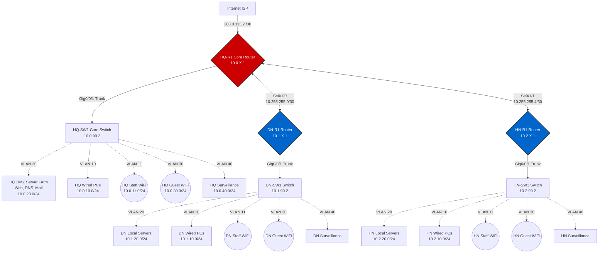

# RiverBank Network Architecture Report

This document outlines the comprehensive network design and topology for RiverBank (formerly BB Bank), encompassing the Headquarters in Ho Chi Minh City and two regional branches in Da Nang and Ha Noi.

## 🏢 Executive Summary

RiverBank requires a highly secure, available, and scalable network infrastructure to support daily banking operations, customer transactions, and administrative tasks. The system utilizes modern technologies seamlessly integrating Headquarters with Branches using reliable WAN and robust internal segmentation.

## 🌐 Site Specifications

### Headquarters (Ho Chi Minh City)

*   **Building details:** 7 floors with an IT room and Cabling Central Local on the 1st floor.
*   **Scale:** 120 workstations, 5 servers, 12+ networking devices (including security apparatus).
*   **Infrastructure:** Fiber cabling (GPON), Gigabit/10-Gigabit Ethernet, and comprehensive WLAN/LAN setup.
*   **Logical structure:** VLAN-based segregation for different departments with a DMZ for exposed servers.
*   **Internet connection:** Acts as the primary gateway for all Internet traffic. Dual xDSL lines with a load-balancing mechanism to enhance availability.

### Regional Branches (Da Nang & Ha Noi)

*   **Building details:** 2 floors each, equipped with 1 IT room and Cabling Central Local.
*   **Scale:** Small-scale configuration (30 workstations, 3 servers, 5+ networking devices).
*   **Integration:** Relies on the Headquarters for Internet routing.

## 🔒 Security & Connectivity

*   **WAN Connectivity:** SD-WAN or MPLS securely connects HQ with the two branches, ensuring optimal path selection and prioritized banking traffic.
*   **Security measures:** Enterprise-grade Firewalls, IPS/IDS integration, phishing detection, and strict ACL implementations.
*   **Remote Access:** Site-to-Site VPNs for branch interconnectivity and Client-to-Site VPNs for remote teleworker access to the internal network.
*   **Physical Security:** Subnet segregation for an integrated surveillance camera system.

## 📈 Capacity & Workload Estimation

*   **Servers:** Web, database, and updates processing approx. 1000 MB/day (Download) and 2000 MB/day (Upload).
*   **Workstations:** Customer transactions, browsing (500 MB/day Download, 100 MB/day Upload per workstation).
*   **Guest WiFi:** Allocated ~500 MB/day for customer connectivity.
*   **Growth projection:** Architecture accommodates a 20% growth rate in structural nodes and traffic scaling over the next 5 years. Peak hours operate mostly between 09:00-11:00 and 15:00-16:00.

## 🗺️ Topology Diagram

```text
                                   [ Internet ]
                                        |
                              (2x xDSL, Load Balanced)
                                        |
                              [ HQ Perimeter Firewall ]
                                        | (IPS/IDS)
                                [ HQ Core Switch ] === [ DMZ / Server Farm ]
                                 /      |        \         (5 Servers)
                                /       |         \
 [ HQ VLANs (Workstations) ]---+    [ HQ WiFi ]    +---[ HQ Surveillance ]
       (Reduced: 2 PCs)                 |                 (IP Cameras)
                                        |
                            (WAN: SD-WAN / MPLS / VPN)
                                        |
              +-------------------------+-------------------------+
              |                                                   |
   [ Da Nang Branch Router ]                           [ Ha Noi Branch Router ]
              |                                                   |
   [ Branch Core Switch ]                              [ Branch Core Switch ]
     /                \                                  /                \
[ Branch VLANs ]  [ Server Farm ]                   [ Branch VLANs ]  [ Server Farm ]
   (2 PCs)          (3 Servers)                        (2 PCs)          (3 Servers)
```

## 🛠️ Validation & Testing Protocol

*   Internal routing verification between Inter-VLANs.
*   WAN routing verifications between branches and HQ.
*   Ping & Traceroute testing towards Internet Web Servers and isolated Servers inside the DMZ.
*   Strict policy verification to deny Guest WiFi / Customer devices access to Internal LANs.

## 🗺️ Detailed Network Map Report

### 1. Static IP Addressing Map

| Device / Interface | Description | IP Address | Subnet Mask / CIDR | Default Gateway |
| :--- | :--- | :--- | :--- | :--- |
| **HQ-R1 (HQ Router)** |
| `Gig0/0/0` | ISP/Internet Uplink | `203.0.113.2` | `/30` (255.255.255.252) | ISP Router |
| `Serial0/1/0` | P2P link to Da Nang | `10.255.255.1` | `/30` (255.255.255.252) | N/A |
| `Serial0/1/1` | P2P link to Ha Noi | `10.255.255.5` | `/30` (255.255.255.252) | N/A |
| `Gig0/0/1.10 - .99` | HQ Inter-VLAN Gateways | `10.0.X.1` | `/24` (255.255.255.0) | N/A |
| **HQ-SW1 (HQ Switch)** | Mgmt VLAN 99 | `10.0.99.2` | `/24` (255.255.255.0) | `10.0.99.1` |
| **HQ DMZ Servers** | Web / DNS | `10.0.20.5` | `/24` (255.255.255.0) | `10.0.20.1` |
| **DN-R1 (Da Nang)** |
| `Serial0/1/0` | P2P link to HQ | `10.255.255.2` | `/30` (255.255.255.252) | N/A |
| `Gig0/0/1.10 - .99` | DN Inter-VLAN Gateways | `10.1.X.1` | `/24` (255.255.255.0) | N/A |
| **DN-SW1 (DN Switch)** | Mgmt VLAN 99 | `10.1.99.2` | `/24` (255.255.255.0) | `10.1.99.1` |
| **HN-R1 (Ha Noi)** |
| `Serial0/1/0` | P2P link to HQ | `10.255.255.6` | `/30` (255.255.255.252) | N/A |
| `Gig0/0/1.10 - .99` | HN Inter-VLAN Gateways | `10.2.X.1` | `/24` (255.255.255.0) | N/A |
| **HN-SW1 (HN Switch)** | Mgmt VLAN 99 | `10.2.99.2` | `/24` (255.255.255.0) | `10.2.99.1` |

*(Note: Static Infrastructure endpoints strictly utilize `.2` to `.10` on each `/24` subnet)*

### 2. RiverBank Equipment & Device Inventory

**🏢 Headquarters (HQ) - Ho Chi Minh City**
*   **Edge & Security:** 2x Cisco ISR 4000 Routers (HA), 2x Cisco ASA/Firepower Perimeters.
*   **Switching:** 2x Layer 3 Core Switches (Catalyst 3850/9500), ~6x 48-port PoE+ Access Switches (Catalyst 9200L).
*   **Wireless:** 1x WLC, ~14x Cisco Access Points.
*   **Servers:** 6 Servers (Web, DNS, Email, File/FTP, Syslog).
*   **Endpoints:** ~144 Wired PCs, ~216 Staff WiFi Devices, ~216 Guest WiFi Devices.
*   **Surveillance:** 2x 32-channel NVRs, ~42 PoE IP Cameras.

**📍 Regional Branches (Da Nang & Ha Noi - quantities per branch)**
*   **Edge & Security:** 1x Cisco ISR Router w/ Security payload.
*   **Switching:** 1x Layer 3 Core Switch, ~2x 48-port PoE+ Access Switches.
*   **Wireless:** ~4x Cisco Access Points.
*   **Servers:** 4 Local Servers (File/FTP, Local DNS Cache, Print).
*   **Endpoints:** ~36 Wired PCs, ~54 Staff WiFi Devices, ~54 Guest WiFi Devices.
*   **Surveillance:** 1x 16-channel NVR, ~12 PoE IP Cameras.

### 3. Visual Network Diagram



### 4. Verification and Testing Procedures

To certify the deployment works per specification, simulate the following scenarios in Packet Tracer:

1. **Verify DHCP Allocation:** Connect laptops/PCs to switch access ports (e.g. `FastEthernet0/6` for VLAN 10) or Wireless APs. Verify that IP Configuration -> DHCP automatically provides an IP (e.g., `10.1.10.11`) and populates the Default Gateway.
2. **Verify Inter-VLAN & OSPF Routing:** 
   - Open Command Prompt on an HQ PC (VLAN 10) and `ping` a Da Nang PC (`10.1.10.11`).
   - Run `tracert 10.1.10.11` to ensure traffic successfully jumps from HQ-R1 to DN-R1 over the Serial Point-to-Point links.
3. **Verify Security (ACL Boundaries):**
   - Place a device on the HQ Guest WiFi (VLAN 30).
   - Attempt to `ping` a Staff PC (`10.0.10.11`) or a DMZ Server (`10.0.20.5`). Packet Tracer should respond with **"Destination host unreachable"** — confirming isolation.
   - Attempt to ping the `8.8.8.8` (Simulated internet). It should succeed.
4. **Verify DMZ Containment:**
   - From the DMZ Web Server (`10.0.20.5`), attempt to `ping` the Internal HQ PC (`10.0.10.11`). It should **fail** (blocked by `HQ_DMZ_CONTAINMENT`). 
   - Ensure the server can still successfully reply to incoming web HTTP requests via the browser.
5. **Verify PAT / Port Forwarding (Internet):** 
   - Add a PC outside of HQ-R1 representing an internet consumer. 
   - Open its Web Browser and go to `203.0.113.2`. HQ-R1's NAT rule should forward port 80 requests directly to `10.0.20.5` inside the HQ Server Farm, loading the secure web portal.
