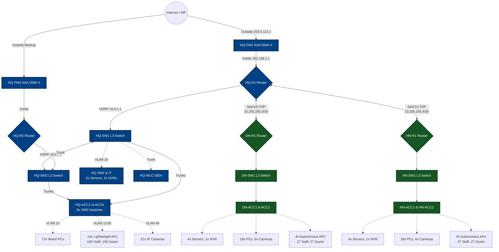

# RiverBank Network: Enterprise Cisco Packet Tracer Setup Guide

This document provides a comprehensive walkthrough to build, configure, and verify the RiverBank network topology in Cisco Packet Tracer 9.0.0. This guide strictly implements the `equipment-inventory.md` requirements (with workstation/endpoint counts reduced by 50% as requested for simulation performance).

## 🗺️ Visual Network Topology Diagram

Before building the topology, review this high-level structure to understand how the massive 350+ node scale is logically grouped into Core, Distribution, and Access layers:

## Phase 1: Physical Enterprise Topology Deployment

### 1. Hardware Deployment List

Drag and drop the following devices onto your workspace. Group them logically by site.

**Headquarters (HQ) - Ho Chi Minh City:**

*   **Edge & Security:**
    *   2x Cisco 4331 Routers (`HQ-R1`, `HQ-R2`). *Turn off, add `NIM-2T` modules, turn on.*
    *   2x Cisco ASA 5506-X Firewalls (`HQ-FW1`, `HQ-FW2`)
*   **Core & Distribution Switching:**
    *   2x Layer 3 Switches - Cisco 3650 (`HQ-SW1`, `HQ-SW2`). *Turn off, drag the GLC-T modules into the SFP uplink slots, and turn on to enable Gi1/1/x ports.*
*   **Access Switching:**
    *   6x Layer 2 Switches - Cisco 2960 (`HQ-ACC1` through `HQ-ACC6`)
*   **Wireless Infrastructure:**
    *   1x WLC-3504 Wireless LAN Controller (`HQ-WLC`)
    *   14x Lightweight APs - LAP-PT (`HQ-LAP1` to `HQ-LAP14`)
*   **Servers & Surveillance (DMZ & IT Room):**
    *   6x Server-PT (Web, DNS, Email, File/FTP, Syslog, Backup)
    *   2x Server-PT or IoT-Monitor (acting as NVRs)
*   **Endpoints (Reduced by 50% for PT performance):**
    *   72x PCs (Wired)
    *   108x Laptops / Smartphones (Staff WiFi)
    *   108x Smartphones (Guest WiFi)
    *   21x IP Cameras (PoE)

**Regional Branches (Da Nang & Ha Noi) - *Quantities per branch*:**

*   **Edge & Security:**
    *   1x Cisco 4331 Router (`DN-R1` / `HN-R1`). *Turn off, add `NIM-2T`, turn on.*
*   **Core & Access Switching:**
    *   1x Layer 3 Switch - Cisco 3650 (`DN-SW1` / `HN-SW1`)
    *   2x Layer 2 Switches - Cisco 2960 (`DN-ACC1` to `DN-ACC2` / `HN-ACC1` to `HN-ACC2`)
*   **Wireless Infrastructure:**
    *   4x AccessPoint-PT (`DN-AP1` to `DN-AP4` / `HN-AP1` to `HN-AP4`)
*   **Servers & Surveillance:**
    *   4x Server-PT (File/FTP, Local DNS, Print, DHCP backup)
    *   1x Server-PT (acting as NVR)
*   **Endpoints (Reduced by 50% for PT performance):**
    *   18x PCs (Wired)
    *   27x Laptops / Smartphones (Staff WiFi)
    *   27x Smartphones (Guest WiFi)
    *   6x IP Cameras (PoE)

### 2. Physical Cabling & Connections

Given the massive number of endpoints, meticulously follow this exact port-mapping schema to ensure the CLI configurations apply without errors.

#### 🏢 HQ Core & Edge Routing Cabling
| Source (device:port) | Destination (device:port) | Cable Type | Notes |
| :--- | :--- | :--- | :--- |
| ISP Cloud/Router (Gi0/0) | HQ-FW1 (Outside - Gi1/1) | Straight-Through | Simulated Public Internet |
| ISP Cloud/Router (Gi0/1) | HQ-FW2 (Outside - Gi1/1) | Straight-Through | Redundant ISP Link |
| HQ-FW1 (Inside - Gi1/2) | HQ-R1 (GigabitEthernet0/0/0) | Straight-Through | Active Firewall to Active Router |
| HQ-FW2 (Inside - Gi1/2) | HQ-R2 (GigabitEthernet0/0/0) | Straight-Through | Standby Firewall to Standby Router |
| HQ-R1 (GigabitEthernet0/0/1) | HQ-SW1 (GigabitEthernet1/1/1) | Straight-Through | Router-on-a-Stick Trunk |
| HQ-R2 (GigabitEthernet0/0/1) | HQ-SW2 (GigabitEthernet1/1/1) | Straight-Through | HA Router-on-a-Stick Trunk |
| HQ-SW1 (GigabitEthernet1/1/2) | HQ-SW2 (GigabitEthernet1/1/2) | Cross-Over | Core Inter-Switch Link (ISL) |

#### 🌍 WAN (Serial P2P) Cabling
| Source (device:port) | Destination (device:port) | Cable Type | Notes |
| :--- | :--- | :--- | :--- |
| HQ-R1 (Serial0/1/0) | DN-R1 (Serial0/1/0) | Serial DCE | Clock rate generated by HQ-R1 |
| HQ-R1 (Serial0/1/1) | HN-R1 (Serial0/1/0) | Serial DCE | Clock rate generated by HQ-R1 |

#### 🏢 HQ Distribution & Access Layer Cabling
| Source (device:port) | Destination (device:port) | Cable Type | Target Network |
| :--- | :--- | :--- | :--- |
| HQ-SW1 (GigabitEthernet1/0/1 to 1/0/3) | HQ-ACC1 to ACC3 (GigabitEthernet0/1) | Straight-Through | Uplinks (Trunks) |
| HQ-SW2 (GigabitEthernet1/0/1 to 1/0/3) | HQ-ACC4 to ACC6 (GigabitEthernet0/1) | Straight-Through | Uplinks (Trunks) |
| HQ-SW1 (GigabitEthernet1/0/24) | HQ-WLC-3504 (GigabitEthernet1) | Straight-Through | WLC Management |
| HQ-SW1 (GigabitEthernet1/0/10 to 1/0/15) | HQ DMZ Servers (FastEthernet0) | Straight-Through | Server Farm (VLAN 20) |
| HQ-ACCx (FastEthernet0/6 to 0/10) | HQ Wired PCs (FastEthernet0) | Straight-Through | Staff Desktops (VLAN 10) |
| HQ-ACCx (FastEthernet0/11 to 0/15) | HQ-LAPx (FastEthernet0) | Straight-Through | LAPs (VLAN 11/30) |
| HQ-ACCx (FastEthernet0/21 to 0/24) | HQ IP Cameras (FastEthernet0) | Straight-Through | Surveillance (VLAN 40) |

#### 📍 Regional Branches (Da Nang & Ha Noi) Cabling
| Source (device:port) | Destination (device:port) | Cable Type | Target Network |
| :--- | :--- | :--- | :--- |
| Branch-R1 (GigabitEthernet0/0/1) | Branch-SW1 (GigabitEthernet1/1/1) | Straight-Through | Router-on-a-Stick Trunk |
| Branch-SW1 (GigabitEthernet1/0/1) | Branch-ACC1 (GigabitEthernet0/1) | Straight-Through | Uplink to Access 1 |
| Branch-SW1 (GigabitEthernet1/0/2) | Branch-ACC2 (GigabitEthernet0/1) | Straight-Through | Uplink to Access 2 |
| Branch-ACCx (FastEthernet0/1 to 0/5) | Branch Servers (FastEthernet0) | Straight-Through | Local Servers (VLAN 20) |
| Branch-ACCx (FastEthernet0/6 to 0/10) | Branch Wired PCs (FastEthernet0) | Straight-Through | Staff Desktops (VLAN 10) |
| Branch-ACCx (FastEthernet0/11 to 0/15) | Branch APs (FastEthernet0) | Straight-Through | Autonomous APs (VLAN 11) |
| Branch-ACCx (FastEthernet0/21 to 0/24) | Branch IP Cameras (FastEthernet0) | Straight-Through | Surveillance (VLAN 40) |

---

## Phase 2: Core Device Configurations (CLI)

*To configure these devices efficiently, use the modular scripts provided in `config/cisco-config.md`. Copy and paste the blocks into the CLI tab of the respective devices.*

### 1. High Availability HQ Core Setup

1.  **Firewalls (`HQ-FW1`, `HQ-FW2`):** Configure the Active/Standby ASA block. Set outside IP to `203.0.113.2` and inside to `192.168.1.1` (See Section 10.2).
2.  **Routers (`HQ-R1`, `HQ-R2`):** Apply the base WAN, OSPF, NAT, DHCP, and ACL configurations (See Section 1). Then apply the **HSRP** configuration (See Section 10.1) to ensure `.1` is the virtual gateway while `.2` and `.3` act as physical interface IPs.
3.  **Switches (`HQ-SW1/2`, `HQ-ACC1-6`):**
    *   Create VLANs 10, 11, 20, 30, 40, 99 on all switches.
    *   Configure Gigabit uplinks as `mode trunk`.
    *   Assign FastEthernet ports to respective Access VLANs based on the endpoint plugged into it (See Section 8 and 10.3).

### 2. Branch Setups

1.  **Routers (`DN-R1`, `HN-R1`):** Apply standard Branch router config (OSPF Area 0, DHCP Pools, NAT Overload, WAN IPs) from Sections 4 and 6.
2.  **Switches (`DN-SW1`, `DN-ACC1-2`):** Create VLANs and configure trunks and access ports appropriately.

---

## Phase 3: Server & Wireless Configuration (GUI)

### 1. DMZ Servers (HQ) & Local Servers (Branches)

1.  Click **Server** -> **Desktop** -> **IP Configuration**.
2.  Assign static IPs from the `.2` to `.10` range of their respective Server/DMZ subnets (e.g., VLAN 20).
3.  *Web Server (HQ):* IP `10.0.20.5`. Turn HTTP service ON.
4.  *DNS Server (HQ):* IP `10.0.20.6`. Turn DNS service ON. Add A-Record for `www.riverbank.com` pointing to `10.0.20.5`.
5.  *(Optional)* Enable Syslog and Email services on the other dedicated servers to simulate active loads.

### 2. HQ Wireless LAN Controller (WLC-3504)

1.  Connect a configuration PC to the WLC management port and access `http://<WLC-IP>`.
2.  Navigate to **CONTROLLER** -> **Interfaces**. Create `vlan11_staff` and `vlan30_guest`.
3.  Navigate to **WLANs**. Create `RiverBank_Staff` (WPA2-PSK: `RiverBank2024`) and `RiverBank_Guest` (`WelcomeGuest`).
4.  Ensure the HQ DHCP scope provides Option 43 pointing to the WLC IP. The 14 LAPs will automatically join and broadcast the networks.

### 3. Branch Wireless (Autonomous APs)

1.  Click each AP -> **Config** -> **Port 1**.
2.  Set SSID to `RiverBank_Staff` or `RiverBank_Guest` with corresponding WPA2-PSK keys.

---

## Phase 4: Final Validation Testing

Due to the massive size of this Packet Tracer simulation (over 400 total nodes), test connectivity segment-by-segment:

1.  **DHCP Scalability Check:** Verify that the massive swarms of Wireless devices and PCs are successfully pulling IP addresses in their respective VLANs. Packet Tracer may take a few minutes to converge spanning-tree and DHCP leases.
2.  **Inter-Branch Connectivity:** Ping from an HQ PC (`10.0.10.x`) to a Da Nang PC (`10.1.10.x`) to ensure OSPF Area 0 is routing correctly across the WAN links.
3.  **High Availability (HA) Failover:**
    *   Start a continuous ping to the internet (`ping 8.8.8.8 -t`) from an HQ PC.
    *   Power off `HQ-R1`.
    *   HSRP should elect `HQ-R2` as Active, and traffic should resume after minor packet loss.
4.  **Security Segmentation:** Use a device connected to the Guest WiFi and try to ping the DMZ Web Server (`10.0.20.5`). The ASA/Router ACLs MUST return *Destination host unreachable*.
5.  **CCTV Isolation:** Try to ping a PC from an IP Camera. It should fail due to VLAN 40 isolation policies.
6.  **OSPF MD5 Authentication:** Run `show ip ospf neighbor` on the edge routers to verify that the routing adjacencies successfully establish over the WAN links using the encrypted MD5 keys.
